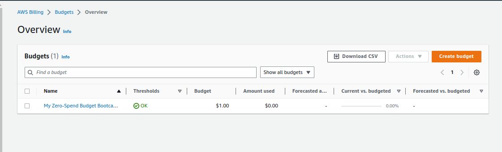
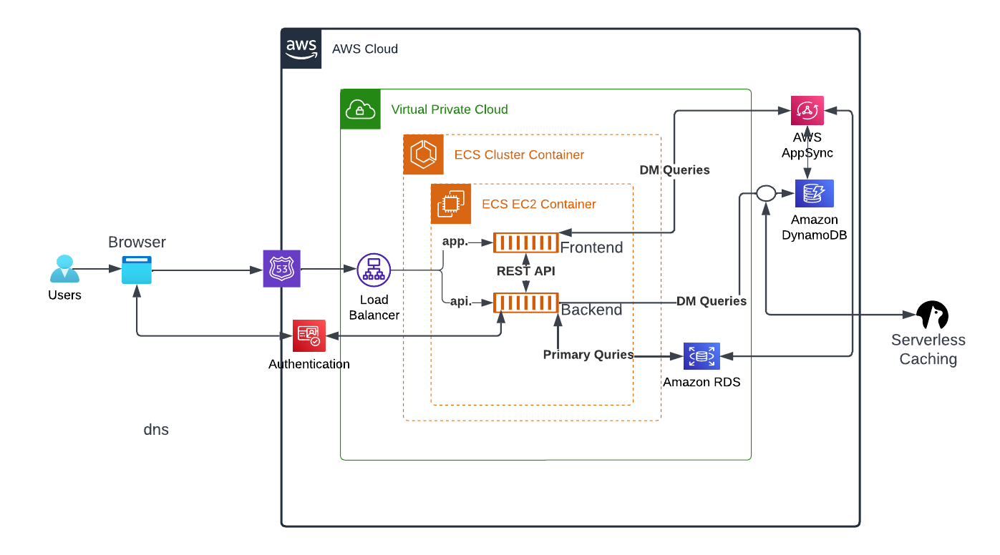

# Week 0 — Billing and Architecture 

## Required homework/tasks

### Install and verify aws cli

### Created a budget
created my own budget for $1

 

### Recreate Cruddur logical Architectural design

[Lucid Charts Share Link](https://lucid.app/lucidchart/3e9f0839-f087-456a-b7ac-6687cae4447e/edit?viewport_loc=-195%2C161%2C1767%2C587%2C0_0&invitationId=inv_b72a4a4b-8470-48d2-9133-2855654d1c02)
